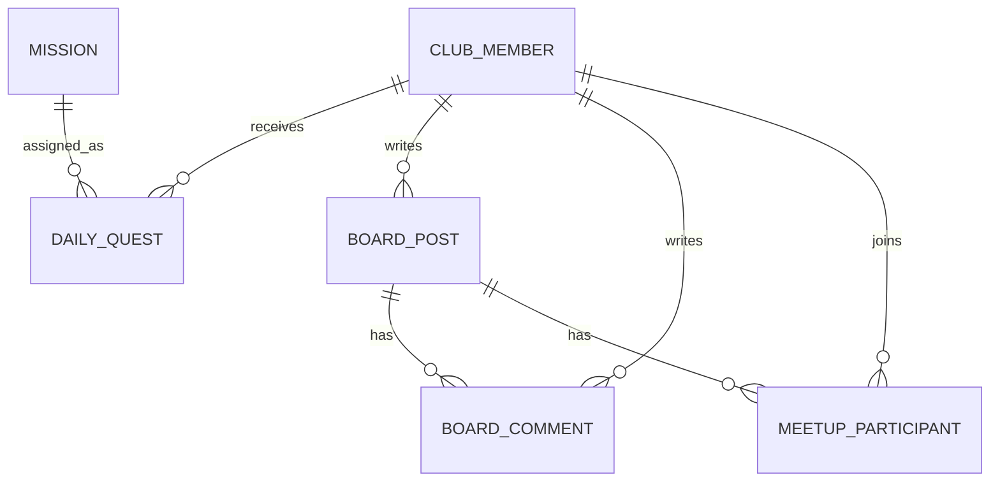

# PLAN QUEST 백엔드 학습 가이드

> 처음부터 순서대로 공부하려면 `PLANQUEST_STUDY_BOOK_MD.md`를 먼저 읽고, 이 문서는 구현 위치와 작업 기록을 빠르게 찾아볼 때 사용한다.

## 1. 프로젝트 소개

PLAN QUEST는 로그인한 사용자에게 하루 하나의 작은 미션을 배정하고, 사진 또는 한 줄 기록으로 인증하게 하는 서비스다. 사용자는 커뮤니티에서 자유 글과 퀘스트 인증 글을 작성하고, 날짜·장소·정원이 포함된 모임을 개설하거나 참가할 수 있다.

기존 영화·회원 예제 코드는 공부 기록으로 남겨 두었다. 다만 PLAN QUEST에서 사용하는 기능은 아니므로 보안을 위해 `/movie`, `/member`, `/reviews`와 예전 업로드 URL의 접근은 막았다. 새 기능은 `/quest`, `/community`, `/suggestions`, `/mypage`, `/auth` 아래에 구성했다.

처음 공부할 때는 다음 순서로 보면 이해하기 쉽다.

```text
SecurityConfig → Controller → Service → Repository → Entity → HTML
```

예를 들어 게시글 작성 기능을 공부한다면 `CommunityController.create()`부터 시작해서 `CommunityService.create()`, `BoardPostRepository`, `BoardPost` 순서로 내려가면 된다.

## 2. 사용 기술

- Java 17
- Spring Boot 4
- Spring MVC + Thymeleaf
- Spring Security
- Spring Data JPA + MySQL
- Multipart 이미지 업로드
- Gradle + JUnit 5

## 3. 레이어 구조

```text
브라우저
  ↓ HTTP 요청
Controller        URL, 폼 데이터, 로그인 사용자 처리
  ↓
Service           트랜잭션과 비즈니스 규칙 처리
  ↓
Repository        JPA를 이용한 DB 조회/저장
  ↓
Entity            데이터와 도메인 상태 변경 규칙
  ↓
MySQL
```

컨트롤러에서 바로 Repository를 호출하지 않은 이유는 HTTP 처리와 비즈니스 규칙을 분리하기 위해서다. 예를 들어 퀘스트 완료 보상 규칙은 화면이나 컨트롤러가 바뀌어도 그대로 재사용할 수 있어야 한다.

## 4. 추가한 폴더와 파일

### 원퀘스트

```text
entity/
  Mission.java                미션 원본
  MissionCategory.java        미션 카테고리 enum
  DailyQuest.java             회원에게 날짜별로 배정된 미션
  QuestStatus.java            ASSIGNED / COMPLETED

repository/
  MissionRepository.java
  DailyQuestRepository.java

service/
  QuestService.java           배정, 교체, 완료, 보상 트랜잭션
  QuestImageStorage.java      인증 이미지 저장/조회

controller/
  QuestController.java        /quest 요청 처리

dto/
  QuestDashboardDTO.java
  QuestCompletionResult.java

templates/quest/
  dashboard.html
```

### 커뮤니티

```text
entity/
  BoardPost.java              게시글 및 모임 정보
  BoardComment.java           댓글
  MeetupParticipant.java      모임 참가자
  BoardCategory.java          FREE / QUEST / MEETUP

repository/
  BoardPostRepository.java
  BoardCommentRepository.java
  MeetupParticipantRepository.java

service/
  CommunityService.java       글, 댓글, 모임 참가 규칙

controller/
  CommunityController.java    /community 요청 처리

dto/
  BoardPostForm.java
  BoardDetailDTO.java

templates/community/
  list.html
  form.html
  detail.html
```

### 로그인과 공통 UI

```text
config/SecurityConfig.java
controller/AuthController.java
service/ClubMemberServiceImpl.java
templates/auth/login.html
templates/auth/register.html
templates/layout/basic.html
static/css/onequest.css
```

## 5. 핵심 데이터 관계



`DailyQuest`에는 `(member_email, quest_date)` 복합 유니크 제약을 걸었다. 따라서 같은 회원에게 같은 날짜의 퀘스트가 DB에 두 개 저장되는 것을 마지막 단계에서도 막는다.

`MeetupParticipant`에도 `(post_id, member_email)` 유니크 제약이 있어 같은 모임에 중복 참가할 수 없다.

## 6. 오늘의 퀘스트 요청 흐름

### 대시보드 조회

1. 브라우저가 `GET /quest`를 요청한다.
2. Spring Security의 `Authentication`에서 로그인 이메일을 얻는다.
3. `QuestService.getDashboard(email)`을 호출한다.
4. 오늘 배정된 `DailyQuest`가 있으면 조회한다.
5. 없다면 활성화된 `Mission` 중 하나를 랜덤으로 골라 저장한다.
6. 내 기록, 최근 사용자 인증, 포인트 정보를 DTO에 넣어 화면에 전달한다.

### 퀘스트 완료

1. `POST /quest/complete`에 한 줄 기록과 선택 이미지가 전달된다.
2. 서비스가 오늘 퀘스트인지, 이미 완료했는지 확인한다.
3. 이미지가 있으면 `QuestImageStorage`가 날짜별 폴더에 UUID 파일명으로 저장한다.
4. `DailyQuest.complete()`가 상태를 `COMPLETED`로 변경한다.
5. `ClubMember.rewardQuest()`가 포인트, 스트릭, 레벨을 계산한다.
6. 하나의 `@Transactional` 범위에서 DB 변경사항이 커밋된다.

## 7. 보상 규칙

현재 MVP 보상은 다음과 같다.

```text
완료 포인트 = 미션 기본 포인트 100P + 스트릭 보너스
스트릭 보너스 = (연속 달성일 - 1) × 10P
스트릭 보너스 최대값 = 100P
레벨 = 누적 포인트 / 500 + 1
```

예시:

| 연속 달성 | 당일 획득 | 누적 예시 |
|---:|---:|---:|
| 1일 | 100P | 100P |
| 2일 | 110P | 210P |
| 3일 | 120P | 330P |
| 4일 | 130P | 460P |
| 5일 | 140P | 600P, Lv.2 |

보상 계산을 `ClubMember` 엔티티에 넣었기 때문에 REST API나 모바일 앱이 추가되어도 같은 규칙을 사용할 수 있다. 같은 날짜에 보상을 다시 요청하면 0P가 반환되고, 서비스에서도 완료 상태를 확인해 중복 요청을 막는다. `@Version`은 동시에 들어온 수정 요청의 유실을 방지한다.

추후 확장 가능한 보상:

- 7일, 30일 연속 달성 뱃지
- 포인트로 퀘스트 교체권 구매
- 프로필 테마 및 칭호 해금
- 모임 참가 후 공동 퀘스트 보너스
- 기간 한정 시즌 레벨

실제 돈이나 상품을 바로 연결하면 정산·부정 인증·운영 정책이 필요하므로 포트폴리오 MVP에서는 디지털 보상이 안전하다.

## 8. 커뮤니티와 모임 흐름

`BoardPost.category`에 따라 하나의 게시글 테이블이 세 역할을 한다.

- `FREE`: 일반 자유 글
- `QUEST`: 퀘스트 후기 또는 인증 이야기
- `MEETUP`: 일정, 장소, 정원이 추가된 모임 글

모임 참가 시 서비스는 다음 순서로 검증한다.

1. `MEETUP` 글인지 확인
2. 모임 시간이 지나지 않았는지 확인
3. 이미 참가했는지 확인
4. 정원이 남았는지 확인
5. `MeetupParticipant` 저장
6. 게시글의 참가 인원 증가

`BoardPost`의 `@Version` 낙관적 잠금은 마지막 한 자리에 여러 요청이 동시에 들어와 정원을 초과하는 상황을 방어한다.

## 9. 주요 URL

| Method | URL | 기능 |
|---|---|---|
| GET | `/` | 공개 랜딩 페이지 |
| GET/POST | `/auth/register` | 회원가입 |
| GET | `/auth/login` | 로그인 페이지 |
| POST | `/login` | Spring Security 로그인 처리 |
| POST | `/logout` | 로그아웃 |
| GET | `/quest` | 오늘의 퀘스트 대시보드 |
| POST | `/quest/reroll` | 하루 1회 미션 교체 |
| POST | `/quest/complete` | 미션 인증 및 완료 |
| GET | `/community` | 게시글 목록 |
| GET/POST | `/community/new`, `/community` | 글 작성 화면/처리 |
| GET | `/community/{id}` | 글과 댓글 상세 |
| POST | `/community/{id}/comments` | 댓글 등록 |
| POST | `/community/{id}/join` | 모임 참가 |
| POST | `/community/{id}/leave` | 모임 참가 취소 |

컨텍스트 경로가 `/ex76`이므로 로컬 전체 주소는 `http://localhost:8081/ex76/quest` 형식이다.

## 10. 실행 방법

MySQL에 `db7` 데이터베이스와 사용자가 준비되어 있다는 기존 수업 환경을 기준으로 한다.

```powershell
.\gradlew.bat bootRun
```

브라우저에서 `http://localhost:8081/ex76`에 접속하고 회원가입한다.

같은 프로젝트를 두 번 실행하면 `Port 8081 was already in use` 오류가 발생한다. 이 경우 먼저 실행한 애플리케이션의 정지 버튼을 누른 뒤 다시 실행하면 된다. 기본 포트를 다시 바꾸고 싶다면 `application.properties`의 다음 값을 수정한다.

```properties
server.port=8081
```

다른 DB 계정을 사용할 경우 환경변수로 설정할 수 있다.

```powershell
$env:DB_URL='jdbc:mysql://localhost:3306/onequest'
$env:DB_USERNAME='root'
$env:DB_PASSWORD='비밀번호'
$env:UPLOAD_PATH='C:/upload'
.\gradlew.bat bootRun
```

테이블은 현재 `spring.jpa.hibernate.ddl-auto=update`로 자동 반영된다. 실제 배포 단계에서는 Flyway 같은 DB 마이그레이션 도구와 `validate` 설정을 사용하는 것이 좋다.

## 11. 포트폴리오에서 설명할 내용

프로젝트 설명 예시:

> 매일 하나의 랜덤 미션을 배정하고 사용자 인증, 스트릭 보상, 커뮤니티 모임 개설을 지원하는 Spring Boot 서비스입니다. 회원·날짜 복합 유니크 제약과 트랜잭션으로 중복 보상을 방지했으며, 낙관적 잠금을 적용해 모임 정원 동시성 문제를 방어했습니다.

강조할 기술 포인트:

- Spring Security 인증 주체를 서비스까지 이메일로 전달
- Controller–Service–Repository 레이어 분리
- 엔티티 메서드로 보상과 상태 변경 규칙 캡슐화
- DB 유니크 제약을 이용한 중복 배정·중복 참가 방어
- `@Transactional`을 이용한 퀘스트 완료와 보상 원자성
- `@Version` 낙관적 잠금을 이용한 동시성 제어
- Multipart 이미지 검증, UUID 파일명, 경로 정규화
- PRG(Post/Redirect/Get) 패턴과 FlashAttribute 사용

## 12. 다음 개선 순서

1. 서비스 단위 테스트와 컨트롤러 MockMvc 테스트 확대
2. 이미지 파일과 DB 트랜잭션 간 실패 보상 처리
3. QueryDSL을 이용한 게시글 제목·내용 검색
4. 뱃지와 포인트 사용 내역 테이블 추가
5. 관리자용 미션 CRUD 화면
6. Docker와 GitHub Actions를 이용한 배포 자동화
7. Flyway DB 마이그레이션 도입

## 13. 추가 구현 기능

### 마이페이지

`GET /mypage`에서 다음 활동을 한 번에 조회한다.

- 누적 포인트, 레벨, 현재 스트릭
- 완료 퀘스트 수
- 작성한 게시글·댓글 수
- 참가한 모임 수와 참가 예정 모임
- 카테고리별 완료 횟수
- 최근 퀘스트와 최근 게시글
- 획득한 뱃지

관련 파일:

```text
controller/MyPageController.java
service/MyPageService.java
dto/MyPageDTO.java
dto/CategoryStatDTO.java
templates/mypage/index.html
```

마이페이지용 별도 활동 테이블을 만들지 않고 기존 테이블을 집계했다. 동일한 데이터를 두 군데 저장하면 정합성을 맞추기 어렵기 때문이다.

### 뱃지

```text
Badge        뱃지 종류와 설명
MemberBadge 회원이 획득한 뱃지
```

`MemberBadge`의 `(member_email, badge_id)`에 유니크 제약을 두어 같은 뱃지를 중복 획득할 수 없다. `BadgeService.evaluate()`가 회원 활동을 집계하고 조건을 만족한 뱃지만 저장한다.

현재 뱃지:

| 뱃지 | 조건 |
|---|---|
| 첫걸음 | 퀘스트 1회 완료 |
| 작심삼일 성공 | 3일 연속 완료 |
| 일주일의 기적 | 7일 연속 완료 |
| 소통왕 | 댓글 10개 작성 |
| 모임의 시작 | 모임 1회 개설 |
| 함께하는 사람 | 모임 3회 참가 |
| 계획의 시작 | 퀘스트 10회 완료 |
| 플랜 마스터 | 퀘스트 30회 완료 |
| 이야기꾼 | 게시글 5개 작성 |
| 인기 플래너 | 내가 쓴 글의 좋아요 합계 10개 |
| 균형 잡힌 도전자 | 모든 퀘스트 카테고리에서 1회 이상 완료 |
| 이번 주 올클리어 | 이번 주 월요일부터 일요일까지 7개 완료 |

퀘스트 완료, 댓글 작성, 게시글·모임 생성, 모임 참가 후 `BadgeService`를 호출한다. 다른 회원이 게시글에 좋아요를 누른 뒤에는 그 글의 작성자를 검사한다. 마이페이지 진입 시에도 한 번 검사하므로 과거 활동을 가진 기존 회원도 뱃지를 받을 수 있다.

### 게시글 검색

`BoardPostRepository.search()`에서 카테고리와 검색어를 함께 처리한다.

```text
GET /community?category=MEETUP&keyword=산책&page=0
```

제목과 본문 중 하나에 검색어가 포함되면 결과에 나타난다. 검색 조건과 페이지 번호를 URL에 남겨 새로고침과 링크 공유가 가능하다.

### 좋아요

```text
PostLike
- post
- member
- likedAt
```

`(post_id, member_email)` 유니크 제약으로 중복 좋아요를 DB에서도 방어한다. `POST /community/{postId}/like`를 다시 호출하면 좋아요가 취소되는 토글 방식이다. 목록 조회 성능을 위해 `BoardPost.likeCount`에도 현재 개수를 저장한다.

### 사용자 미션 제안

일반 회원은 `/suggestions/new`에서 미션을 제안할 수 있다.

```text
PENDING  검토 중
APPROVED 승인
REJECTED 반려
```

관리자만 `@PreAuthorize("hasRole('ADMIN')")`가 적용된 승인·반려 서비스를 호출할 수 있다. 승인된 제안은 오늘의 랜덤 퀘스트가 되는 것이 아니라 다른 회원이 수행자로 참가할 수 있는 모집 미션이 된다.

관련 파일:

```text
entity/MissionSuggestion.java
entity/SuggestionStatus.java
repository/MissionSuggestionRepository.java
service/MissionSuggestionService.java
controller/MissionSuggestionController.java
templates/suggestion/list.html
templates/suggestion/form.html
templates/suggestion/detail.html
```

## 14. 추가된 요청 흐름

### 좋아요 토글

```text
POST /community/{id}/like
  → CommunityController.toggleLike()
  → CommunityService.toggleLike()
  → 기존 PostLike 조회
     ├─ 존재: 삭제하고 likeCount 감소
     └─ 없음: 저장하고 likeCount 증가
  → 상세 페이지로 redirect
```

### 관리자 미션 승인

```text
POST /suggestions/{id}/approve
  → 로그인 사용자의 ADMIN 권한 검사
  → PENDING 상태인지 검사
  → SuggestionStatus.APPROVED 변경
  → 다른 회원의 미션 수락 버튼 활성화
  → 트랜잭션 커밋
```

## 15. 추가 테스트

```text
ExtendedFeatureDomainTests
- 좋아요 카운터가 0 아래로 내려가지 않는지 검증
- 검토 완료된 미션 제안을 다시 처리할 수 없는지 검증

ExtendedFeatureIntegrationTests
- 제목·본문 및 카테고리 검색 검증
- 첫 퀘스트 완료 뱃지 자동 지급 검증
- 좋아요 추가·취소 토글 검증
- ADMIN 권한 승인 시 수행자 모집 상태 변경 검증
```

실행 명령:

```powershell
.\gradlew.bat test
```

## 16. 발표 때 보여주기 좋은 순서

1. 로그인 후 오늘의 퀘스트 완료
2. 포인트와 스트릭 증가 확인
3. 마이페이지에서 `첫걸음` 뱃지와 활동 통계 확인
4. 게시판에서 `산책`을 검색하고 글에 좋아요
5. 새로운 미션을 제안
6. 관리자 계정에서 제안을 승인하고 다른 회원으로 미션을 수락

포트폴리오 설명 예시:

> 사용자 활동을 실시간 집계하는 마이페이지와 조건 기반 뱃지 시스템을 구현했습니다. 게시글 좋아요와 회원·게시글 조합에 유니크 제약을 적용해 중복 요청을 방어했고, 승인된 사용자 미션은 다른 회원이 수행자로 참여할 수 있도록 구성했습니다.

## 17. 전체 점검 후 수정한 내용

기능 테스트를 하면서 새 기능과 예전 수업 코드가 섞이는 부분, 오류 화면, 모바일 메뉴를 확인했다. 너무 복잡한 구조를 추가하지 않고 수업에서 배운 방식으로 고쳤다.

| 수정 내용 | 수정한 파일 | 핵심 생각 |
|---|---|---|
| 본인 회원정보만 수정 | `AuthController`, `ClubMemberService`, `ClubMemberServiceImpl` | 폼의 이메일 대신 로그인 정보를 사용 |
| 내 정보 수정 화면 연결 | `auth/modify.html`, `mypage/index.html` | 마이페이지에서 수정 화면으로 이동 |
| 예전 수업 URL 차단 | `SecurityConfig` | 코드는 남기되 사용자 접근은 거부 |
| 비밀번호 화면 출력 제거 | `member/list.html`, `member/read.html`, `member/modify.html` | 비밀번호는 화면에 보여 주지 않음 |
| 파일 경로 검사 | `UploadController` | 업로드 폴더 밖의 경로는 거부 |
| 실제 이미지 검사 | `UploadController`, `QuestImageStorage` | `ImageIO`로 읽을 수 있는 이미지인지 확인 |
| 공통 오류 처리 | `GlobalExceptionHandler`, `NotFoundException`, `error/common.html` | 400·404·500 화면 구분 |
| 접근 제한 안내 | `CustomAccessDeniedHandler`, `auth/accessDenied.html` | 차단된 URL을 403 안내 화면으로 연결 |
| 모바일 메뉴 | `layout/basic.html`, `onequest.css`, `onequest.js` | 작은 화면에서 햄버거 버튼으로 메뉴 열기 |
| 입력 길이 검사 | 회원·커뮤니티·미션 제안 서비스 | HTML 검사와 서버 검사를 함께 사용 |
| 전체 흐름 테스트 | `WorkflowAuditIntegrationTests` | 퀘스트·모임·권한·회원 수정 검증 |

## 18. 회원정보 수정 흐름

```text
GET /auth/modify
  → AuthController.modifyForm()
  → 로그인 이메일로 현재 회원 조회
  → auth/modify.html 출력

POST /auth/modify
  → Authentication.getName()으로 로그인 이메일 확인
  → ClubMemberService.modify(loginEmail, form)
  → 로그인한 ClubMember만 조회
  → 닉네임 또는 비밀번호 변경
  → /mypage로 redirect
```

중요한 부분은 화면에서 넘어온 `dto.email`을 수정 대상 선택에 사용하지 않는 것이다. 브라우저의 폼 값은 사용자가 바꿀 수 있기 때문이다.

```java
clubMemberService.modify(authentication.getName(), dto);
```

서비스도 같은 원칙으로 로그인 이메일을 사용한다.

```java
ClubMember member = clubMemberRepository.findById(loginEmail)
    .orElseThrow(() -> new IllegalArgumentException("회원을 찾을 수 없습니다."));
```

## 19. 예전 수업 코드 처리

예전 `Member`, `Movie`, `Review`, `UploadController` 코드를 바로 삭제하지는 않았다. 수업에서 만들었던 코드를 비교해 볼 수 있기 때문이다. 대신 PLAN QUEST 회원이 직접 주소를 입력해 접근하지 못하도록 `SecurityConfig`에서 막았다.

```java
.requestMatchers("/member/**", "/movie/**", "/reviews/**",
    "/uploadAjax", "/display", "/removeFile").denyAll()
```

차단된 주소에 접근하면 `CustomAccessDeniedHandler`가 `/auth/accessDenied`로 이동시켜 간단한 안내 화면을 보여 준다.

## 20. 공통 오류 처리 흐름

기존에는 없는 게시글에 접근하면 Whitelabel 화면과 스택 트레이스가 보였다. 지금은 서비스에서 찾지 못한 경우 `NotFoundException`을 발생시키고 공통 처리 클래스가 404 화면을 보여 준다.

```text
CommunityService.getPost()
  → 게시글 없음
  → NotFoundException
  → GlobalExceptionHandler.notFound()
  → error/common.html
```

오류 상태는 다음처럼 나누었다.

| 상태 | 의미 | 예시 |
|---:|---|---|
| 400 | 요청 값이 잘못됨 | 존재하지 않는 카테고리 문자열 |
| 403 | 권한이 없음 | 예전 관리자용 URL 접근 |
| 404 | 데이터를 찾지 못함 | 없는 게시글 번호 |
| 500 | 예상하지 못한 서버 오류 | 처리 중 알 수 없는 예외 |

사용자 화면에는 짧은 안내만 보여 주고, 500 오류의 자세한 내용은 서버 로그로 확인한다.

## 21. 파일 업로드에서 확인할 부분

파일명은 사용자가 보낸 값이므로 그대로 경로에 붙이면 안 된다. `UploadController.safePath()`는 다음 순서로 검사한다.

1. 업로드 기준 폴더를 절대 경로로 만든다.
2. 전달받은 파일명을 기준 폴더에 붙인다.
3. `normalize()`로 `..` 같은 경로를 정리한다.
4. 최종 경로가 업로드 폴더 안에서 시작하는지 확인한다.
5. 폴더 밖이면 요청을 거부한다.

또한 Content-Type만 확인하지 않고 `ImageIO.read()` 결과가 있는지 검사한다. 이미지처럼 이름만 바꾼 일반 파일을 걸러 내기 위한 간단한 방법이다.

## 22. 입력값을 두 번 검사하는 이유

HTML의 `maxlength`, `min`, `max`는 사용자가 입력할 때 도움을 준다. 하지만 개발자 도구나 별도 프로그램으로 요청하면 HTML 검사를 건너뛸 수 있다. 그래서 서비스에서도 다시 확인한다.

현재 기준은 다음과 같다.

| 값 | 제한 |
|---|---:|
| 닉네임 | 30자 |
| 비밀번호 | 4~50자 |
| 게시글 제목 | 160자 |
| 게시글 내용 | 5000자 |
| 댓글 | 600자 |
| 모임 장소 | 150자 |
| 모임 정원 | 2~100명 |
| 미션 제안 제목 | 120자 |
| 미션 제안 설명 | 500자 |
| 퀘스트 한 줄 기록 | 500자 |

## 23. 모바일 메뉴 동작

화면 폭이 860px보다 작으면 일반 메뉴를 숨기고 `☰` 버튼을 보여 준다.

```text
☰ 클릭
  → onequest.js
  → nav-links에 open 클래스 추가
  → CSS의 .nav-links.open 적용
  → 메뉴 표시
```

다시 누르면 `open` 클래스를 제거해 메뉴를 닫는다. 별도 프레임워크 없이 HTML, CSS, JavaScript만 사용했다.

## 24. 테스트 결과와 실행 방법

전체 자동 테스트 실행:

```powershell
.\gradlew.bat test
```

현재 결과:

```text
전체 41개
통과 40개
실패 0개
비활성화 1개
```

비활성화된 하나는 예전 영화 리뷰 테스트다. 기존 MySQL의 `review` 테이블에 과거 `member_v2` 외래키가 남아 있어 보류한 것이며 PLAN QUEST 기능 테스트 실패는 아니다.

`WorkflowAuditIntegrationTests`에서 확인하는 내용:

- 새 회원의 퀘스트 배정과 하루 1회 교체
- 퀘스트 완료 포인트와 첫걸음 뱃지
- 중복 퀘스트 완료 차단
- 모임 정원 초과 차단과 탈퇴 후 자리 반환
- 다른 회원의 게시글 수정·삭제 차단
- 일반 회원의 미션 승인 차단
- 폼 이메일을 바꿔도 다른 회원 정보가 수정되지 않는지 확인

`ProfileImageStorageTests`에서 확인하는 내용:

- 실제 PNG 이미지 저장과 다시 조회
- 기존 프로필 이미지 파일 삭제
- 삭제한 이미지를 다시 조회할 때 찾을 수 없음 처리

실제 브라우저에서도 다음을 확인했다.

- 로그인 후 퀘스트·커뮤니티·마이페이지 이동
- 없는 게시글은 404 안내 화면
- 잘못된 카테고리는 400 안내 화면
- 예전 회원·영화 URL은 접근 제한 화면
- 마이페이지에서 내 정보 수정 후 다시 마이페이지로 이동
- 390px 모바일 화면에서 메뉴 버튼과 네 개 메뉴가 정상 표시

## 25. 직접 공부하는 추천 순서

1. `SecurityConfig`에서 공개 URL과 로그인 필요 URL을 구분한다.
2. `AuthController`에서 `Authentication` 사용 부분을 찾는다.
3. `QuestController`와 `QuestService`를 따라가며 퀘스트 완료 흐름을 적어 본다.
4. `CommunityController`와 `CommunityService`에서 글 작성과 모임 참가 흐름을 따라간다.
5. 각 Repository 메서드 이름이 어떤 SQL 역할을 하는지 생각해 본다.
6. Entity의 `addLike`, `addParticipant`, `rewardQuest` 같은 상태 변경 메서드를 확인한다.
7. `GlobalExceptionHandler`의 상태 코드별 메서드를 확인한다.
8. `WorkflowAuditIntegrationTests`를 한 줄씩 주석 처리해 보며 어떤 검증인지 이해한다.

각 기능을 공부할 때 아래 네 질문에 답해 보면 좋다.

```text
1. 어떤 URL로 요청하는가?
2. Controller가 어떤 값을 받는가?
3. Service에서 어떤 규칙을 검사하는가?
4. 어떤 Entity와 Repository가 변경되는가?
```

## 26. 포트폴리오 설명 예시

> 하루 하나의 미션을 수행하고 포인트와 연속 달성을 기록하는 PLAN QUEST를 만들었습니다. Spring Security 로그인 정보를 사용해 본인 데이터만 수정하도록 처리했고, 게시글·댓글·좋아요·모임 참가 기능을 Service 계층에서 구현했습니다. 공통 오류 화면과 입력값 검사를 추가했으며 통합 테스트와 실제 브라우저 테스트로 주요 사용자 흐름을 확인했습니다.

## 27. PLAN QUEST 이름과 프로필 꾸미기

화면에 보이는 서비스 이름을 `ONE QUEST`에서 `PLAN QUEST`로 변경했다. 기존 CSS와 설정의 `onequest` 파일명·속성명은 이미 여러 코드에서 사용하고 있으므로 내부 이름으로 유지했다. 사용자에게 보이는 제목, 로고, 푸터, 설명서만 새 이름으로 통일했다.

마이페이지 프로필 사진은 다음 흐름으로 동작한다.

```text
마이페이지에서 사진 선택
  → POST /mypage/profile-image
  → MyPageController.updateProfileImage()
  → MyPageService.updateProfileImage()
  → ProfileImageStorage.save()
  → ClubMember.profileImagePath에 경로 저장
  → 마이페이지로 redirect
```

사진 파일 자체를 DB에 넣지 않고 업로드 폴더에 저장하며, DB에는 `profile/UUID_파일명` 형태의 경로만 저장한다. 사용자가 사진을 바꾸면 새 사진을 저장하고 이전 사진을 삭제한다.

프로필 사진을 보여 줄 때는 `GET /mypage/profile-image`를 요청한다. Controller가 현재 로그인 회원의 이미지 경로를 조회하기 때문에 다른 회원 이메일을 주소에 넣어 사진을 요청할 수 없다.

프로필 사진 제한:

- 최대 5MB
- 이미지 Content-Type 확인
- `ImageIO`로 실제로 읽을 수 있는 이미지인지 확인
- UUID 파일명을 붙여 이름 충돌 방지
- 신규 뱃지 6종의 활동 조건과 자동 지급 확인
- 초기 데이터에 전체 뱃지 12종이 준비되는지 확인
- 커뮤니티 게시글 사진의 저장·교체·삭제 확인
- 이미지 확장자만 꾸민 가짜 파일 업로드 차단 확인
- 운영자 계정과 비밀번호 암호화 확인
- 공지·고정글 정렬과 일반 회원 권한 차단 확인
- 댓글 고정 1개 제한과 댓글 좋아요 토글 확인

마이페이지의 완료 퀘스트, 연속 달성, 작성한 글, 작성한 댓글, 참가한 모임은 별도 카드에서 프로필 카드 안으로 옮겼다. 데이터 조회 방법은 바뀌지 않았고 HTML 배치만 변경했다. 데스크톱에서는 프로필 사진을 왼쪽에 두고 오른쪽에 닉네임, 이메일, 레벨, 포인트를 세로로 배치한다. 모바일에서는 다시 위아래 구조와 가운데 정렬로 바뀐다. 긴 이메일은 `overflow-wrap: anywhere`로 카드 밖으로 나가지 않고 줄바꿈된다.

## 28. 이번 주 현황과 대표 뱃지

프로필 카드 오른쪽에는 월요일부터 일요일까지의 퀘스트 완료 현황을 표시한다. `MyPageService`가 이번 주의 시작일인 월요일과 마지막 날인 일요일을 계산하고, 해당 기간의 `DailyQuest`를 조회하여 일곱 개의 `WeeklyQuestDTO`로 만든다. 완료한 날은 체크 표시, 오늘은 보라색 테두리로 구분한다.

대표 뱃지는 프로필 정보와 주간 현황 사이에 표시된다. 회원이 아래 `나의 뱃지` 목록에서 `대표로 설정` 버튼을 누르면 다음 순서로 처리된다.

```text
POST /mypage/featured-badge
  → MyPageController.updateFeaturedBadge()
  → MyPageService.updateFeaturedBadge()
  → 실제 획득한 MemberBadge인지 검사
  → ClubMember.featuredBadgeCode에 저장
  → 마이페이지에 대표 뱃지 표시
```

현재 준비된 뱃지는 12종이다. 학생 프로젝트에서 기능을 보여주기에 충분하면서 조건도 어렵지 않도록 구성했다.

| 뱃지 | 조건 | 아이콘 |
|---|---|---|
| 첫걸음 | 첫 퀘스트 완료 | 🌱 |
| 작심삼일 성공 | 3일 연속 완료 | 🔥 |
| 일주일의 기적 | 7일 연속 완료 | 🏆 |
| 소통왕 | 댓글 10개 작성 | 💬 |
| 모임의 시작 | 첫 모임 개설 | 📅 |
| 함께하는 사람 | 모임 3회 참가 | 🤝 |
| 계획의 시작 | 퀘스트 10회 완료 | 🧭 |
| 플랜 마스터 | 퀘스트 30회 완료 | 👑 |
| 이야기꾼 | 게시글 5개 작성 | ✍️ |
| 인기 플래너 | 내가 쓴 글의 좋아요 합계 10개 | 💜 |
| 균형 잡힌 도전자 | 모든 카테고리 퀘스트 완료 | 🌈 |
| 이번 주 올클리어 | 이번 주 7일 퀘스트 완료 | ⭐ |

대표 뱃지는 획득한 뱃지 중에서만 선택할 수 있다. 폼의 `badgeCode`를 임의로 바꾸더라도 서비스에서 `MemberBadge` 존재 여부를 다시 검사해 미획득 뱃지 설정을 막는다.

신규 뱃지는 별도의 복잡한 테이블을 만들지 않고 기존 데이터를 집계한다.

```text
퀘스트 횟수       DailyQuest의 COMPLETED 개수
게시글 횟수       BoardPost 작성 개수
받은 좋아요       내가 작성한 BoardPost.likeCount의 합계
카테고리 달성     완료 퀘스트를 카테고리별로 묶은 결과 개수
주간 올클리어     이번 주 월요일~일요일 사이 완료 개수
```

뱃지는 조건을 처음 만족할 때 `MemberBadge`에 한 번 저장된다. 이후 좋아요가 취소되더라도 이미 달성한 뱃지는 회수하지 않는다.

## 29. 레벨 진행률과 프로필 카드 비율

프로필 카드의 남는 공간은 새로운 기능을 많이 추가하지 않고 기존 데이터를 보기 좋게 활용했다. 프로필 사진, 대표 뱃지, 주간 현황의 크기를 조금 키우고 회원정보 아래에 다음 레벨 진행률을 표시한다.

현재 레벨은 500P마다 올라가므로 계산은 다음과 같다.

```text
현재 레벨 진행 포인트 = 누적 포인트 % 500
진행률 = 현재 레벨 진행 포인트 × 100 / 500
다음 레벨까지 필요한 포인트 = 500 - 현재 레벨 진행 포인트
```

예를 들어 누적 포인트가 100P이면 진행률은 20%이고 다음 레벨까지 400P가 남는다. 이 값은 `MyPageService`에서 계산해 `MyPageDTO`에 담고, 마이페이지의 진행 막대 너비로 사용한다.

면접이나 발표에서는 모든 코드를 외우기보다 다음 세 가지를 직접 설명할 수 있으면 된다.

- Controller, Service, Repository를 나눈 이유
- 요청 폼의 이메일이 아니라 로그인 정보를 사용한 이유
- 모임 정원과 중복 참가를 서비스와 DB에서 함께 막은 방법

## 30. 커뮤니티 사진과 보기 방식

커뮤니티 게시글에는 사진을 선택 사항으로 1장 첨부할 수 있다. DB에는 이미지 자체를 넣지 않고 `BoardPost.imagePath`에 상대 경로만 저장한다. 실제 파일은 업로드 폴더의 `community/연도/월` 아래에 UUID가 붙은 이름으로 저장한다.

```text
글 작성 폼
  → MultipartFile image
  → CommunityImageStorage.save()
  → 실제 이미지인지 확인
  → 파일 저장
  → BoardPost.imagePath에 상대 경로 저장
```

사진은 최대 5MB이며 Content-Type뿐 아니라 `ImageIO`로 실제로 읽을 수 있는 이미지인지도 확인한다. 따라서 확장자만 `.png`로 바꾼 일반 텍스트 파일은 저장되지 않는다.

글 수정에서는 세 가지 경우를 나눈다.

- 새 사진을 선택하지 않으면 기존 사진 유지
- 새 사진을 선택하면 기존 파일을 지우고 교체
- `현재 사진 삭제`를 선택하면 경로와 파일을 함께 삭제

게시글 자체를 삭제할 때도 연결된 사진 파일을 함께 삭제한다. 브라우저에는 `GET /community/{postId}/image`가 파일을 읽어 응답한다.

커뮤니티 목록의 보기 방식은 별도 DB 저장 없이 URL의 `view` 값으로 처리한다.

```text
/community?view=card  사진 중심 카드형
/community?view=list  제목·작성자 중심 목록형
```

검색, 카테고리 선택, 페이지 이동 링크에도 현재 `view` 값을 계속 전달한다. 카드형에서는 사진이 없는 글에 간단한 기본 영역을 보여주며, 목록형에서는 사진이 있는 글 제목 옆에 카메라 표시를 붙인다.

## 31. 운영자와 커뮤니티 관리 기능

학생 프로젝트 시연을 위한 기본 운영자 계정은 다음과 같다.

```text
아이디   admin
비밀번호 1234
권한     USER, ADMIN
```

`AdminAccountInitializer`가 애플리케이션 시작 시 계정을 준비한다. 비밀번호는 평문으로 DB에 넣지 않고 `PasswordEncoder`로 암호화해서 저장한다. 실제 서비스로 배포할 때는 기본 비밀번호를 환경 변수로 분리하고 더 강한 값으로 변경해야 한다.

기존 `오이데~` 회원에는 DB에서 `ADMIN` 역할을 한 번 추가했다. 로그인 권한은 세션을 만들 때 읽으므로 역할 변경 전에 로그인해 있었다면 로그아웃 후 다시 로그인해야 한다.

운영자는 커뮤니티에서 다음 작업을 할 수 있다.

- 공지사항 작성
- 다른 회원이 작성한 게시글 수정·삭제
- 일반 게시글 상단 고정과 고정 해제
- 다른 회원의 댓글 삭제
- 게시글 작성자와 동일하게 댓글 고정
- 기존 관리자 미션 승인·반려 기능 사용

공지 작성 권한은 화면에서 공지 카테고리를 숨기는 것만으로 끝내지 않는다. 사용자가 요청 값을 직접 `NOTICE`로 바꿔 보내더라도 `CommunityService`에서 ADMIN 역할을 다시 확인한다.

게시글 목록 정렬 순서는 다음과 같다.

```text
1. 공지사항
2. 운영자가 고정한 일반 게시글
3. 나머지 게시글
```

`BoardPost.pinned`에 고정 여부를 저장하고 Repository 조회문의 `order by`에서 공지 여부, 고정 여부, 최신 글 ID 순으로 정렬한다. 공지사항은 작성될 때 자동으로 고정되며 일반 고정 해제 버튼을 제공하지 않는다.

댓글에는 다음 필드와 테이블을 추가했다.

```text
BoardComment.pinned     상단 고정 여부
BoardComment.likeCount  좋아요 표시용 개수
CommentLike             어떤 회원이 어떤 댓글을 좋아했는지 기록
```

`CommentLike`의 `(comment_id, member_email)` 조합에는 유니크 제약이 있어 한 회원이 같은 댓글에 좋아요를 여러 번 저장할 수 없다. 같은 버튼을 다시 누르면 좋아요가 취소된다.

게시글 작성자가 댓글을 고정하면 기존에 고정된 댓글을 먼저 해제하므로 게시글마다 고정 댓글은 최대 1개다. 운영자도 관리 목적으로 같은 기능을 사용할 수 있다.

## 32. 이메일 대신 아이디와 비밀번호 확인

새 회원가입 화면은 이메일을 받지 않고 아이디를 받는다. 아이디는 영문 대·소문자와 숫자를 사용해 4~30자로 제한한다. 대소문자를 구분하지 않으며 가입과 로그인 시 내부에서 소문자로 맞춘다.

```text
아이디
비밀번호
비밀번호 확인
닉네임
```

기존 프로젝트에서 `ClubMember.email`을 여러 외래키가 회원 PK로 사용하고 있었기 때문에 DB 컬럼 이름까지 한꺼번에 바꾸면 마이그레이션이 복잡해진다. 학생 프로젝트에서는 내부 필드 이름은 유지하고, 새 가입 값과 화면의 의미를 아이디로 변경했다. 기존 회원은 이전에 사용하던 값을 아이디처럼 그대로 입력하면 로그인할 수 있다.

회원가입 서비스는 비밀번호와 비밀번호 확인이 같은지 다시 검사한다. HTML 검사는 사용자를 돕는 역할이고 실제 보호는 서버의 `ClubMemberServiceImpl.register()`에서 담당한다.

비밀번호 변경은 다음 세 칸을 사용한다.

```text
현재 비밀번호
새 비밀번호
새 비밀번호 확인
```

`PasswordEncoder.matches()`로 현재 비밀번호를 확인하고 새 비밀번호 두 값이 일치할 때만 암호화해서 저장한다. 닉네임만 바꿀 때는 비밀번호 세 칸을 모두 비워 둘 수 있다.

## 33. 운영자 고정글 순서와 수정 권한

운영자는 다른 회원의 게시글을 삭제하거나 상단 고정할 수 있지만 수정할 수는 없다. 화면에서 수정 버튼을 숨기는 것과 함께 서비스에서도 작성자 여부를 검사한다.

```text
수정  작성자만 가능
삭제  작성자 또는 운영자
고정  운영자만 가능
```

`BoardPost.pinOrder`는 고정 게시글 사이의 순서를 저장한다. 운영자 화면에서 HTML5 Drag and Drop으로 항목을 옮기고 `순서 저장`을 누르면 게시글 ID 목록이 서버로 전송된다. 서버는 전달된 ID가 현재 고정글 전체와 정확히 일치하는지 확인한 뒤 1번부터 순서를 다시 저장한다.

공지사항은 항상 일반 고정글보다 먼저 나오고, 같은 종류 안에서는 `pinOrder`가 작은 글이 먼저 나온다.

## 34. 오늘의 퀘스트 메인과 웹 전용 미션

로그인에 성공하면 오늘의 퀘스트로 이동한다. 상단 로고도 오늘의 퀘스트로 연결하며 커뮤니티는 바로 다음 메뉴에서 이용할 수 있다.

메인 오늘 미션에는 `Mission.webFriendly=true`인 미션만 사용한다. 미션 제안에서 승인된 미션은 별도 활동용이므로 메인 랜덤 미션에 바로 섞이지 않는다.

웹 전용 미션 예시:

- 브라우저 탭 세 개 정리하기
- 바탕화면 파일 하나 정리하기
- 메모장에 오늘 할 일 세 개 쓰기
- 즐겨찾기 하나 정리하기
- 키보드 주변 3분 정리
- 다운로드 폴더 파일 하나 정리하기

모두 집 컴퓨터나 노트북 앞에서 짧게 끝낼 수 있고 한 줄 기록이나 화면 사진으로 인증하기 쉽다.

## 35. 신고·문의 관리

커뮤니티 게시글과 댓글, 미션 제안에는 신고 링크를 추가했다. 일반 문의도 같은 접수 구조를 사용한다.

```text
UserReport
- reporter       신고·문의 작성자
- kind           REPORT 또는 INQUIRY
- targetType     POST, COMMENT, SUGGESTION, GENERAL
- targetId       대상 데이터 ID
- targetTitle    접수 당시 확인용 제목
- reason         내용
- status         PENDING, RESOLVED, DISMISSED
```

운영자로 로그인하면 상단 메뉴에 `신고·문의`가 추가된다. 운영자는 접수 내용을 확인하고 `처리 완료` 또는 `문제 없음`으로 상태를 변경할 수 있다. 일반 회원이 관리자 주소를 직접 입력하더라도 `@PreAuthorize("hasRole('ADMIN')")` 검사를 통과할 수 없다.

## 36. 포인트 도움 미션

미션 제안자는 보유 포인트 중 일부를 보상으로 걸 수 있다. 0P 미션도 운영자가 승인하면 다른 회원이 수행할 수 있고, 포인트를 걸었다면 최종 완료 후 수행자에게 지급한다.

```text
1. 제안 등록       작성자 포인트 차감 후 보관
2. 운영자 승인     수행자 모집 시작
3. 다른 회원 요청  작성자에게 알림 전송
4. 작성자 수락     수행자 확정과 채팅 시작
5. 수행자 완료     수행 완료 확인
6. 작성자 완료     도움을 받았다는 확인
7. 운영자 승인     수행자에게 포인트 지급
```

운영자가 제안을 반려하면 등록할 때 보관한 포인트는 작성자에게 환불한다. 승인 후에는 작성자와 수행자가 모두 완료를 눌러야 운영자의 `포인트 교환 승인` 버튼이 나타난다.

`MissionSuggestion.pointsSettled`로 지급 완료 여부를 저장하기 때문에 운영자가 같은 요청을 다시 보내도 포인트가 두 번 지급되지 않는다. 포인트 증감은 `ClubMember.spendPoints()`와 `addPoints()`에서 처리하며 잔액에 맞춰 레벨도 다시 계산한다.

미션 목록에서 제목이나 `미션 자세히 보기`를 누르면 `/suggestions/{id}` 상세 화면으로 이동한다. 상세 화면에는 작성자, 설명, 보상 포인트, 현재 수행자와 `미션 수락 요청` 버튼이 표시된다. 작성자는 자신의 미션을 수락할 수 없으며, 승인된 미션에 수행자나 대기 중인 신청자가 없을 때만 다른 회원에게 버튼이 나타난다. 요청을 보냈다고 바로 수행자가 되는 것은 아니고 작성자가 확인해야 최종 수행자로 정해진다.

## 37. 수락 알림, 10분 자동 취소와 실시간 채팅

다른 회원이 `미션 수락 요청`을 누르면 바로 수행자로 확정하지 않는다. `MissionSuggestion.applicant`와 `acceptRequestedAt`에 요청자와 시간을 저장하고 작성자에게 알림을 보낸다.

```text
수락 요청
  → 작성자 벨 알림
  → 작성자가 10분 안에 수행자로 수락
     ├─ 수락: performer 확정, WebSocket 채팅 개방
     └─ 미확인: applicant 초기화, 다시 수행자 모집
```

`@EnableScheduling`과 `@Scheduled(fixedDelay = 60_000)`을 사용해 1분마다 10분이 지난 요청을 찾는다. 미션 상세 페이지에 들어갈 때도 만료 시간을 다시 검사하므로 이미 10분이 지났다면 즉시 요청을 취소한다. 여기서 취소되는 것은 미션 게시글 자체가 아니라 수행자 수락 요청이며, 미션은 다시 다른 사람을 모집할 수 있다.

알림은 `UserNotification` 테이블에 저장한다. 우측 상단 벨 아이콘에는 읽지 않은 개수가 표시되고, 알림을 누르면 관련 미션 상세 페이지로 이동하면서 읽음 처리된다.

실시간 채팅에는 Spring WebSocket과 STOMP를 사용한다.

```text
연결 주소    /ws-mission
메시지 전송  /app/suggestions/{id}/chat
메시지 구독  /topic/suggestions/{id}
```

브라우저가 메시지를 전송하면 `MissionChatController`가 받아 `MissionSuggestionService`에서 DB에 먼저 저장한다. 저장된 결과를 해당 미션 토픽에 전송하므로 작성자와 수행자의 화면에 바로 나타나고, 새로고침해도 이전 대화가 남는다.

WebSocket 주소를 안다고 누구나 채팅을 볼 수 있는 것은 아니다. `ChannelInterceptor`가 SEND와 SUBSCRIBE 요청의 로그인 사용자를 확인하고, 수행자가 확정된 미션의 작성자·수행자·운영자만 통과시킨다.

## 38. 첫 화면 퀘스트 카드 정적 디자인 처리

로그인 전 첫 화면(`/`) 오른쪽의 `오늘 하늘 한 장 찍기` 카드는 실제 오늘의 퀘스트를 완료하는 화면이 아니라 서비스 분위기와 사용 예시를 보여주는 랜딩 페이지용 디자인이다.

기존 `CLEAR +100P` 표시에는 링크나 JavaScript 기능이 없었지만 공통 버튼 클래스인 `btn-oq`를 사용하고 있어 마우스를 올리면 움직이고 클릭할 수 있는 버튼처럼 보였다. 이를 실제 버튼과 구분하기 위해 `index.html`에서 공통 버튼 클래스를 제거하고 `hero-clear-preview`라는 정적 디자인 클래스로 변경했다.

```html
<div class="hero-clear-preview" aria-hidden="true">CLEAR +100P</div>
```

`onequest.css`에서는 다음 성격을 가지도록 처리했다.

- 기존의 초록색 완료 표시 디자인 유지
- `cursor: default`로 일반 마우스 모양 사용
- `pointer-events: none`으로 클릭과 마우스 이벤트 차단
- `user-select: none`으로 장식 문구 드래그 선택 방지
- 버튼 hover 이동 효과 제거

따라서 이 카드는 첫 화면의 정적인 예시 이미지처럼만 보인다. 실제 퀘스트 완료는 로그인 후 `/quest` 화면에서 인증 글이나 사진을 등록해 처리한다.

수정 파일:

```text
src/main/resources/templates/index.html
src/main/resources/static/css/onequest.css
```

## 39. 운영자 전용 공지 쓰기 버튼

공지사항 작성 기능 자체는 기존에도 구현되어 있었다. 운영자가 일반 `새 글 쓰기` 화면에 들어가 종류를 `공지`로 선택하면 작성할 수 있었고, `CommunityService.validate()`가 일반 회원의 공지 등록을 차단한다. 하지만 커뮤니티 목록에 공지 전용 진입 버튼이 없어 기능을 찾기 어려웠다.

커뮤니티 목록 상단의 버튼 영역을 다음 순서로 변경했다.

```text
[공지 쓰기]  [+ 새 글 쓰기]
```

- `공지 쓰기`는 `sec:authorize="hasRole('ADMIN')"`을 사용해 운영자에게만 보인다.
- 요청대로 빨간색 `btn-oq danger` 스타일을 사용한다.
- 버튼 주소는 `/community/new?category=NOTICE`이다.
- `새 글 쓰기` 왼쪽에 배치된다.
- 일반 회원은 기존 `새 글 쓰기` 버튼만 볼 수 있다.

`CommunityController.createForm()`은 선택적인 `category` 요청값을 받도록 수정했다. 요청한 카테고리가 현재 로그인 사용자의 작성 가능 카테고리 목록에 포함되어 있을 때만 폼의 초기값으로 넣는다.

```java
if (category != null && categories.contains(category)) {
    form.setCategory(category);
}
```

따라서 운영자가 `공지 쓰기`를 누르면 작성 폼의 종류가 바로 `공지`로 선택된다. 일반 회원이 주소에 `category=NOTICE`를 직접 입력해도 일반 회원용 카테고리 목록에는 공지가 없으므로 공지로 미리 선택되지 않으며, POST 요청을 직접 조작하더라도 Service가 다시 운영자 권한을 확인해 차단한다.

작성된 공지사항은 생성과 동시에 상단 고정 상태가 되고, 운영자가 고정글 순서 영역에서 드래그하여 다른 고정글과 순서를 조정할 수 있다.

수정 파일:

```text
src/main/resources/templates/community/list.html
src/main/java/com/example/ex76/controller/CommunityController.java
```
